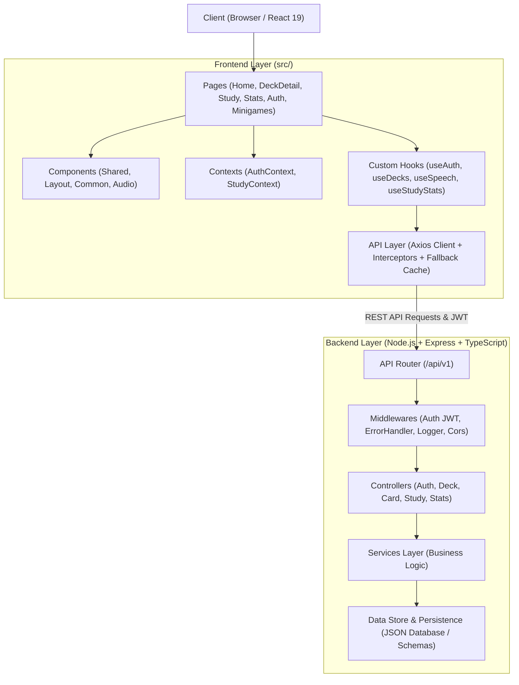

# 🎓 LinguaLeap - Nền Tảng Học Tiếng Anh Thông Minh (Hệ Thống Đồ Án Tốt Nghiệp)

> Dự án Fullstack Web Application được chuẩn hóa theo kiến trúc **Đồ Án Tốt Nghiệp (DATN)** với phân tách rõ ràng giữa **Frontend (React 19 + TypeScript + Tailwind CSS)** và **Backend (Node.js + Express + TypeScript RESTful API)**.

---

## 🏛️ 1. Sơ Đồ Kiến Trúc Hệ Thống (DATN Architecture)



---

## 📂 2. Cấu Trúc Thư Mục Chuẩn Hóa

### 🌐 Frontend Structure (`frontend/`):
```text
src/
├── api/                  # Tầng giao tiếp API với Backend
│   ├── axiosInstance.ts  # Axios client với Interceptors & JWT Token injection
│   ├── authApi.ts        # API Đăng nhập, đăng ký, lấy thông tin cá nhân
│   ├── deckApi.ts        # API CRUD bộ thẻ học (kèm local cache fallback)
│   ├── cardApi.ts        # API thêm/sửa/xóa thẻ trong bộ thẻ
│   └── studyApi.ts       # API ghi nhận kết quả học tập & bảng xếp hạng
├── assets/               # Hình ảnh, icon, tài nguyên tĩnh
├── components/           # Tầng Component giao diện
│   ├── common/           # Các component tái sử dụng (SpeechButton, Modal, Badge)
│   ├── general/          # Header, Sider, 404 Not Found
│   ├── layout/           # DefaultLayout, AuthLayout
│   └── shared/           # FlashCard (Audio TTS), DragDropCard, Loading
├── constants/            # Các hằng số hệ thống
│   ├── endpoint.ts       # Định nghĩa toàn bộ endpoint API (/api/v1/...)
│   ├── routers.ts        # Định nghĩa các Route URL frontend
│   └── storage.ts        # Key lưu trữ LocalStorage / SessionStorage
├── contexts/             # State Management với React Context
│   └── AuthContext.tsx   # Quản lý trạng thái đăng nhập, User, Token toàn cục
├── data/                 # Dữ liệu khởi tạo & mock data fallback
│   └── mockData.ts       # Danh sách 6+ bộ thẻ mẫu phong phú
├── hooks/                # Custom React Hooks
│   ├── useAuth.ts        # Hook truy xuất AuthContext
│   ├── useDecks.ts       # Hook fetch & quản lý danh sách bộ thẻ
│   ├── useSpeech.ts      # Hook phát âm tiếng Anh chuẩn (Web Speech API)
│   └── useStudyStats.ts  # Hook thống kê tiến độ học, streak, XP
├── pages/                # Các trang chức năng theo module
│   ├── auth/             # Trang Đăng nhập (LoginPage) & Đăng ký (RegisterPage)
│   ├── home/             # Trang chủ, tìm kiếm, lọc bộ thẻ
│   ├── deck-detail/      # Chi tiết bộ thẻ & chọn 5 chế độ học
│   ├── create-deck/      # Tạo bộ thẻ mới & thêm từ vựng/ngữ pháp
│   ├── study/            # Chế độ học Flashcard + Kéo thả ngữ pháp (Drag & Drop)
│   ├── test/             # Chế độ làm bài kiểm tra trắc nghiệm & tự luận
│   ├── minigame/         # Minigame Typing Shooter (Gõ phím bắn từ vựng)
│   ├── zen/              # Chế độ Zen World Builder
│   ├── written/          # Chế độ luyện viết (Written Practice)
│   └── stats/            # Trung tâm thống kê tiến độ, Streak & Leaderboard
├── types/                # Định nghĩa TypeScript Types & Interfaces
│   ├── auth.types.ts     # User, LoginDTO, RegisterDTO, AuthResponse
│   ├── deck.types.ts     # Deck, FlashcardItem, DragDropItem, WordType
│   ├── study.types.ts    # StudySessionRecord, UserStats, Leaderboard
│   └── api.types.ts      # ApiResponse<T> chuẩn
├── App.tsx               # Cấu hình Routing & Context Providers
└── main.tsx              # React Root Entrypoint
```

---

### ⚙️ Backend Structure (`backend/`):
```text
backend/
├── src/
│   ├── config/           # Cấu hình môi trường (Port, JWT Secret, DB Path)
│   │   └── env.ts
│   ├── controllers/      # Tầng điều khiển tiếp nhận Request & Response
│   │   ├── auth.controller.ts   # Đăng ký, đăng nhập, get profile
│   │   ├── deck.controller.ts   # Lấy danh sách, chi tiết, tạo, sửa, xóa bộ thẻ
│   │   ├── card.controller.ts   # Thêm, cập nhật, xóa thẻ
│   │   ├── study.controller.ts  # Ghi nhận phiên học, lịch sử học tập
│   │   └── stats.controller.ts  # Tổng quan hệ thống & Leaderboard
│   ├── middlewares/      # Tầng trung gian kiểm soát
│   │   ├── auth.middleware.ts   # Xác thực JWT Token (Bearer token)
│   │   ├── error.middleware.ts  # Bắt lỗi toàn cục (Global Centralized Error Handler)
│   │   └── logger.middleware.ts # Ghi log mọi HTTP request & response time
│   ├── models/           # Tầng dữ liệu & Persistence
│   │   ├── db.ts                # Database Engine tự động lưu trữ và đồng bộ
│   │   └── seedData.ts          # Bộ dữ liệu mẫu phong phú (TOEIC, IELTS, Travel...)
│   ├── routes/           # Định tuyến REST API
│   │   ├── auth.routes.ts       # /api/v1/auth
│   │   ├── deck.routes.ts       # /api/v1/decks
│   │   ├── card.routes.ts       # /api/v1/cards
│   │   ├── study.routes.ts      # /api/v1/study
│   │   ├── stats.routes.ts      # /api/v1/stats
│   │   └── index.ts             # Gom cụm các routes dưới /api/v1
│   ├── services/         # Tầng xử lý nghiệp vụ chính (Business Logic)
│   │   ├── auth.service.ts      # Mã hóa mật khẩu (bcrypt), cấp phát JWT
│   │   ├── deck.service.ts      # Nghiệp vụ tìm kiếm, phân trang, lọc bộ thẻ
│   │   ├── card.service.ts      # Xử lý thẻ flashcard / kéo thả
│   │   ├── study.service.ts     # Tính điểm XP, tính chuỗi ngày học Streak
│   │   └── stats.service.ts     # Thống kê tổng hợp học viên
│   ├── types/            # TypeScript interfaces cho Backend
│   ├── utils/            # Tiện ích bổ trợ (ApiResponse, AppError, JWT, Password)
│   ├── app.ts            # Khởi tạo Express App & Middleware
│   └── server.ts         # Khởi động HTTP Server lắng nghe cổng 8000
├── package.json
├── tsconfig.json
└── .env
```

---

## 🚀 3. Hướng Dẫn Cài Đặt & Chạy Hệ Thống

### Cách 1: Chạy đồng thời cả Frontend và Backend (Khuyên dùng)
Tại thư mục gốc `D:\Web_English`:
```bash
# Cài đặt dependencies toàn bộ dự án
npm install

# Khởi chạy đồng thời Backend (Port 8000) & Frontend (Port 8443 / 5173)
npm run dev
```

### Cách 2: Chạy độc lập từng phần

#### 🔹 Chạy Backend API Server:
```bash
cd backend
npm install
npm run dev
```
* Backend API sẽ chạy tại: **`http://localhost:8000/api/v1`**
* Kiểm tra Health Check: **`http://localhost:8000/api/v1/health`**

#### 🔹 Chạy Frontend Client:
```bash
cd frontend
npm install
npm run dev
```
* Truy cập giao diện ứng dụng trên trình duyệt: **`http://localhost:5173`**

---

## 📡 4. Tài Liệu RESTful API Chi Tiết

### 🔑 Authentication (`/api/v1/auth`)
| Phương thức | Endpoint | Mô tả | Yêu cầu Auth |
|---|---|---|---|
| `POST` | `/api/v1/auth/register` | Đăng ký tài khoản mới (`name`, `email`, `password`) | Không |
| `POST` | `/api/v1/auth/login` | Đăng nhập hệ thống & nhận JWT Bearer Token | Không |
| `GET` | `/api/v1/auth/me` | Lấy thông tin tài khoản hiện tại | `Bearer Token` |

*Tài khoản thử nghiệm sẵn:*
* **Email:** `student@example.com`
* **Mật khẩu:** `password123`

---

### 📚 Decks Management (`/api/v1/decks`)
| Phương thức | Endpoint | Mô tả |
|---|---|---|
| `GET` | `/api/v1/decks` | Lấy danh sách bộ thẻ (Hỗ trợ `?search=...&category=...`) |
| `GET` | `/api/v1/decks/:id` | Lấy thông tin chi tiết 1 bộ thẻ cùng danh sách từ vựng |
| `POST` | `/api/v1/decks` | Tạo mới bộ thẻ học kèm danh sách thẻ |
| `PUT` | `/api/v1/decks/:id` | Cập nhật thông tin bộ thẻ |
| `DELETE` | `/api/v1/decks/:id` | Xóa bộ thẻ |

---

### 📊 Study Sessions & Analytics (`/api/v1/study` & `/api/v1/stats`)
| Phương thức | Endpoint | Mô tả |
|---|---|---|
| `POST` | `/api/v1/study/sessions` | Ghi nhận kết quả sau khi hoàn thành ôn tập / kiểm tra |
| `GET` | `/api/v1/study/history` | Lấy danh sách lịch sử các phiên học của học viên |
| `GET` | `/api/v1/study/stats` | Lấy thông số tổng quan: Chuỗi ngày Streak, Tổng XP, Độ chính xác |
| `GET` | `/api/v1/stats/leaderboard`| Lấy bảng xếp hạng Top học viên chăm chỉ nhất |
| `GET` | `/api/v1/stats/summary` | Lấy số liệu thống kê tổng thể nền tảng |

---

## ✨ 5. Các Tính Năng Điểm Nhấn (DATN Highlights)
1. **Flashcard Lật Thẻ Thông Minh:** Tích hợp phát âm tiếng Anh giọng chuẩn bản xứ thông qua Web Speech API.
2. **Kéo Thả Ngữ Pháp (Drag & Drop Sentence Builder):** Học viên sắp xếp các thành phần câu theo đúng trật tự ngữ pháp chuẩn.
3. **Đa Dạng Chế Độ Ôn Luyện:** Flashcards, Kiểm tra trắc nghiệm (Test Mode), Luyện viết (Written Practice), Minigame Typing Shooter và Zen World Builder.
4. **Hệ Thống Thống Kê & Động Lực Học Tập:** Chuỗi ngày học liên tục (Streak), Điểm kinh nghiệm tích lũy (XP), Phân tích độ chính xác theo thời gian thực.
5. **Cơ Chế Khả Dụng Cao (Graceful Resilience):** Tự động đồng bộ và lưu cache nếu backend ngoại tuyến, đảm bảo trải nghiệm học tập không bao giờ bị gián đoạn.
