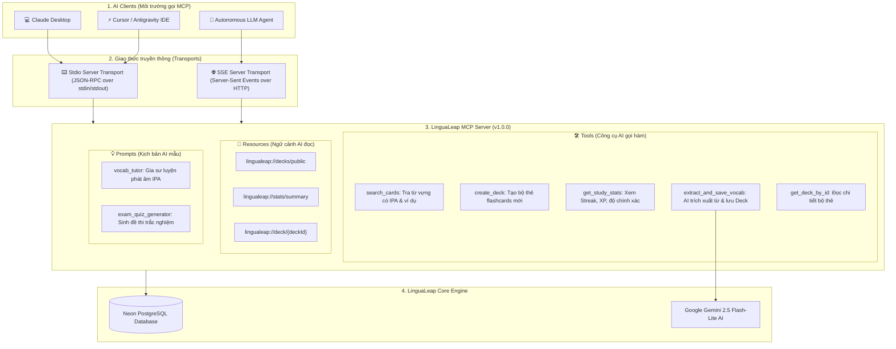

# 🔌 Giao Thức Model Context Protocol (MCP) - LinguaLeap
> **Dự Án Đồ Án Tốt Nghiệp (DATN):** Nền tảng học tiếng Anh thông minh LinguaLeap  
> **Chuẩn giao tiếp:** Model Context Protocol (MCP v1.31) do Anthropic khởi xướng, hỗ trợ Claude Desktop, Cursor, Antigravity và các LLM Agents.

---

## 📌 1. Tổng Quan Về Model Context Protocol (MCP)

**Model Context Protocol (MCP)** là một tiêu chuẩn mở (Open Standard) mang tính cách mạng trong kỷ nguyên AI Agent, đóng vai trò như cổng kết nối an toàn (Secure Gateway) giữa các Mô hình ngôn ngữ lớn (LLMs) và kho dữ liệu nghiệp vụ của LinguaLeap.

Thay vì chỉ là một ứng dụng web đóng kín, việc tích hợp MCP biến **LinguaLeap thành một "kho tri thức và công cụ sống"** cho phép các Trợ lý AI bên ngoài (Claude Desktop, Cursor, AI IDE) có thể:
1. **Truy vấn từ vựng chuẩn xác (kèm phiên âm IPA quốc tế & ngữ cảnh)** trực tiếp từ CSDL Neon PostgreSQL.
2. **Tự động tạo Deck và nạp thẻ mới vào hệ thống** khi người dùng trò chuyện với AI.
3. **Theo dõi tiến độ học tập, chuỗi Streak và độ chính xác** của học viên.
4. **Trích xuất thông minh từ vựng từ văn bản bất kỳ** thông qua pipeline Google Gemini tích hợp.



---

## 🛠️ 2. Danh Sách 5 Công Cụ (Tools) MCP Đã Triển Khai

| Tên Tool | Mục Đích Nghiệp Vụ | Tham Số Đầu Vào |
| :--- | :--- | :--- |
| **`search_cards`** | Tra cứu từ vựng trong CSDL LinguaLeap theo từ khóa Anh/Việt. Trả về từ, phiên âm IPA, nghĩa, và câu ví dụ ngữ cảnh. | `query` (bắt buộc), `category` (tùy chọn), `limit` (mặc định 10) |
| **`create_deck`** | Cho phép AI tạo trực tiếp một bộ thẻ flashcards mới trong CSDL LinguaLeap sau khi đàm thoại với người dùng. | `title`, `description`, `category`, `cards` (danh sách front, back, phonetic, ví dụ) |
| **`get_study_stats`** | Lấy số liệu học tập của học viên (chuỗi Streak, tổng số thẻ đã học, XP, độ chính xác trung bình, lịch sử ôn tập gần nhất). | `userId` (tùy chọn, mặc định lấy học viên tích cực nhất) |
| **`extract_and_save_vocab`** | Nhận một đoạn văn bản tiếng Anh, tự động dùng Gemini AI phân tích, trích xuất từ vựng quan trọng kèm IPA và lưu thành Deck trên hệ thống. | `text` (văn bản tiếng Anh), `deckTitle`, `category` |
| **`get_deck_by_id`** | Lấy toàn bộ danh sách thẻ, thông tin tác giả và số lượng mục của một bộ thẻ bất kỳ. | `deckId` (ID bộ thẻ) |

---

## 📄 3. Danh Sách Tài Nguyên (Resources) & Kịch Bản (Prompts)

### Tài nguyên ngữ cảnh (Resources):
* **`lingualeap://decks/public`**: Cung cấp danh sách các bộ thẻ cộng đồng chất lượng cao nhất cho AI tham khảo.
* **`lingualeap://stats/summary`**: Cung cấp tổng quan chỉ số hệ sinh thái (tổng số học viên, tổng bộ thẻ, tổng số thẻ từ vựng).
* **`lingualeap://deck/{deckId}`**: Resource Template động cho phép AI đọc toàn bộ nội dung của bất kỳ bộ thẻ nào theo ID.

### Kịch bản AI mẫu (Prompts):
* **`vocab_tutor`**: Thiết lập AI đóng vai trò **Gia sư tiếng Anh tương tác chuyên sâu**, hướng dẫn khẩu hình phát âm theo bảng phiên âm quốc tế IPA và sửa lỗi ngữ pháp trong câu trả lời của người học.
* **`exam_quiz_generator`**: Tự động sinh đề thi trắc nghiệm 5 câu hỏi phong phú (đồng nghĩa, điền từ, ngữ cảnh) dựa trên từ vựng của bộ thẻ chỉ định.

---

## 🚀 4. Hướng Dẫn Chạy & Kiểm Thử MCP Server

### Cách 1: Chạy Test Suite Tự Động (Khuyên dùng)
Tại thư mục `backend`, chạy lệnh:
```bash
npm run mcp:test
```
*Script sẽ tự động khởi tạo kết nối In-Memory Transport, kiểm tra 5 Tools, đọc Resources, sinh Prompt và xác nhận 100% chức năng hoạt động hoàn hảo.*

### Cách 2: Khởi chạy MCP Server qua Stdio Transport
```bash
npm run mcp:stdio
```
*Server sẽ lắng nghe các bản tin chuẩn JSON-RPC qua stdin/stdout.*

### Cách 3: Kiểm tra qua giao tiếp HTTP SSE
Khi backend đang chạy (`npm run dev` tại cổng 8000), truy cập vào trình duyệt hoặc cURL:
```bash
curl http://localhost:8000/api/v1/mcp/info
```
*Endpoint trả về thông tin chi tiết về các Tool, Resource và Prompt đang sẵn sàng phục vụ.*

---

## 💻 5. Cấu Hình Tích Hợp Claude Desktop (Windows)

Để kết nối Claude Desktop trực tiếp với cơ sở dữ liệu LinguaLeap của bạn:

1. Mở file cấu hình Claude Desktop tại đường dẫn:
   `%APPDATA%\Claude\claude_desktop_config.json`
2. Dán cấu hình sau:
```json
{
  "mcpServers": {
    "lingualeap": {
      "command": "cmd.exe",
      "args": [
        "/c",
        "npx",
        "--prefix",
        "D:\\Web_English\\backend",
        "tsx",
        "src\\mcp\\stdio.ts"
      ],
      "env": {
        "NODE_ENV": "development"
      }
    }
  }
}
```
3. Khởi động lại Claude Desktop. Biểu tượng **Búa công cụ 🔨** sẽ xuất hiện ở góc dưới khung chat, cho phép bạn gõ các câu lệnh như:
   - *"Tìm trong LinguaLeap các từ vựng về chủ đề công việc kèm phiên âm IPA"*
   - *"Kiểm tra chuỗi Streak và số thẻ đã học của bạn Bích Trâm"*
   - *"Tạo cho tôi một bộ thẻ 5 từ vựng IELTS về môi trường vào LinguaLeap"*

---

## 🎓 6. Kịch Bản Trả Lời Hội Đồng Bảo Vệ Tốt Nghiệp (DATN)

**Câu hỏi 1:** *"Model Context Protocol (MCP) là gì và tại sao em lại tích hợp nó vào đồ án này?"*
> **Trả lời:**
> *"Dạ thưa Thầy/Cô, MCP là giao thức chuẩn mở do Anthropic khởi xướng vào cuối năm 2024 và đang trở thành chuẩn mực công nghiệp để các mô hình ngôn ngữ lớn (LLM) giao tiếp an toàn với dữ liệu nội bộ. Việc tích hợp MCP vào LinguaLeap mang lại 3 giá trị đột phá:*
> 1. **Biến LinguaLeap thành nền tảng mở (Open Platform)**: Học viên có thể sử dụng bất kỳ trợ lý AI nào (Claude, Cursor, Antigravity) để tra từ, tạo thẻ và học tập mà không bị bó hẹp trong một giao diện duy nhất.
> 2. **Giải quyết triệt để vấn đề ảo giác (Hallucination)**: AI không tự bịa từ vựng hay phiên âm sai lệch, mà truy vấn trực tiếp vào CSDL chuẩn mực của LinguaLeap với đầy đủ phiên âm IPA và câu ví dụ đã được kiểm chứng.
> 3. **Tính hai chiều (Read/Write)**: MCP không chỉ cho phép AI đọc dữ liệu (Resources), mà còn trao quyền cho AI tương tác tạo bộ thẻ mới và truy vấn thống kê (Tools) hoàn toàn tự động."*

**Câu hỏi 2:** *"Sự khác biệt giữa việc gọi REST API thông thường và MCP là gì?"*
> **Trả lời xuất sắc:**
> *"Dạ thưa Thầy/Cô, REST API thông thường được thiết kế cho con người hoặc client truyền thống (yêu cầu phải code cứng endpoint, xử lý token và format thủ công). Trong khi đó, MCP là **giao thức thiết kế dành riêng cho Agent AI (AI-Native Protocol)**:*
> - **Tự khám phá (Tool & Resource Discovery)**: AI tự đọc định dạng JSON Schema của các tool mà không cần lập trình viên can thiệp.
> - **Tiêu chuẩn hóa JSON-RPC**: Hỗ trợ cả kênh truyền nối tiếp Stdio (cho ứng dụng máy tính) và Server-Sent Events (cho mạng web), giúp AI có thể chủ động quyết định khi nào cần gọi tool nào dựa trên ngữ cảnh hội thoại của người học."*
