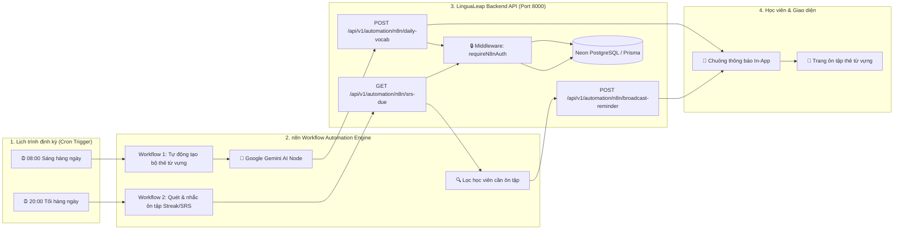

# 🔄 Kiến Trúc Tự Động Hóa Quy Trình Với n8n (n8n Workflow Automation)
> **Dự Án Đồ Án Tốt Nghiệp (DATN):** Nền tảng học tiếng Anh thông minh LinguaLeap  
> **Kiến trúc:** Event-driven & Scheduled Workflow Automation kết hợp Google Gemini AI và PostgreSQL.

---

## 📌 1. Tổng Quan Kiến Trúc Tự Động Hóa

Trong hệ thống **LinguaLeap**, **n8n** đóng vai trò là động cơ điều phối và tự động hóa quy trình nghiệp vụ (Workflow Orchestration Engine). Thay vì phải viết các cron job tĩnh cứng nhắc trong backend Node.js, n8n mang lại các ưu thế vượt trội chuẩn doanh nghiệp:
1. **Trực quan hóa quy trình (Visual Flow)**: Hội đồng chấm thi và giảng viên có thể thấy trực tiếp từng bước dữ liệu chạy qua sơ đồ trực quan.
2. **Khả năng mở rộng không giới hạn**: Dễ dàng tích hợp thêm Telegram Bot, Zalo OA, Discord, gửi Email marketing hoặc Google Sheets mà không cần sửa code backend.
3. **Bảo mật chuẩn REST API**: Giao tiếp giữa n8n và Backend LinguaLeap được bảo vệ bằng Token xác thực `x-n8n-token` hoặc Bearer Token.



---

## 📂 2. Danh Sách 2 Workflow Đã Được Xây Dựng Sẵn

Tất cả các workflow mẫu đều nằm trong thư mục `n8n/workflows/`:

| File Workflow | Mục đích nghiệp vụ | Tần suất |
| :--- | :--- | :--- |
| [`daily_vocab_automation.json`](file:///D:/Web_English/n8n/workflows/daily_vocab_automation.json) | Tự động gọi Gemini AI sinh 5 từ vựng học thuật IELTS/TOEIC mỗi ngày, tự tạo Deck trên hệ thống và bắn thông báo In-App đến tất cả học viên. | 08:00 AM hàng ngày |
| [`srs_streak_reminder.json`](file:///D:/Web_English/n8n/workflows/srs_streak_reminder.json) | Quét cơ sở dữ liệu tìm học viên có nguy cơ đứt chuỗi Streak hoặc có thẻ đến hạn ôn tập ngắt quãng (SRS), tự động gửi cảnh báo nhắc nhở trước 24h. | 20:00 PM hàng ngày |

---

## 🚀 3. Hướng Dẫn Khởi Chạy n8n Trực Tiếp (Trong 2 Phút)

### Cách 1: Khởi chạy nhanh bằng lệnh Node.js (Khuyên dùng)
Bạn mở một cửa sổ Terminal/PowerShell mới và gõ:
```bash
npx n8n
```
*n8n sẽ tự động khởi động và mở giao diện Web tại địa chỉ: `http://localhost:5678`.*

### Cách 2: Khởi chạy bằng Docker (Nếu máy có cài Docker Desktop)
```bash
docker run -it --rm --name n8n -p 5678:5678 -v ~/.n8n:/home/node/.n8n n8nio/n8n
```

---

## 📥 4. Hướng Dẫn Import Workflow Vào n8n

1. Truy cập vào `http://localhost:5678` trên trình duyệt.
2. Tại góc trên bên phải, bấm vào biểu tượng dấu **3 chấm (`...`)** hoặc menu **Workflows**.
3. Chọn **Import from File...**
4. Chọn file [`D:\Web_English\n8n\workflows\daily_vocab_automation.json`](file:///D:/Web_English/n8n/workflows/daily_vocab_automation.json).
5. Bạn sẽ thấy ngay sơ đồ trực quan với các Node:
   - **Schedule Trigger (08:00 AM)**
   - **Gemini AI (Generate 5 Vocab Words)**
   - **Format Payload for LinguaLeap**
   - **LinguaLeap API (Create Deck & Notify)**
6. Bấm nút **Execute Workflow** (hoặc nút **Test step**) để chạy thử ngay lập tức!
7. Quay lại trang web LinguaLeap (`http://localhost:5173`), bạn sẽ thấy:
   - Một bộ thẻ từ vựng mới được tự động tạo bởi **LinguaLeap AI Bot**.
   - Biểu tượng Chuông thông báo 🔔 đỏ lên và hiển thị thông báo mời học từ mới!

---

## 🧪 5. Kiểm Thử Nhanh Bằng Lệnh cURL / PowerShell (Không cần mở n8n)

Nếu muốn test ngay Backend API tiếp nhận webhook của n8n:

### Test 1: Kiểm tra trạng thái n8n Engine
```bash
curl http://localhost:8000/api/v1/automation/n8n/status
```

### Test 2: Mô phỏng cập nhật từ vựng vào Kho Từ Vựng Chọn Lọc (Không tạo rác Deck)
```bash
curl -X POST http://localhost:8000/api/v1/automation/n8n/daily-vocab \
  -H "Content-Type: application/json" \
  -H "x-n8n-token: lingualeap_n8n_secret_token_2026" \
  -d '{
    "topic": "IELTS Academic",
    "cards": [
      {
        "front": "serendipity",
        "phonetic": "/ˌser.ənˈdɪp.ə.ti/",
        "back": "Sự tình cờ may mắn",
        "exampleEn": "Finding this book was pure serendipity.",
        "exampleVi": "Tìm thấy cuốn sách này hoàn toàn là sự tình cờ may mắn."
      },
      {
        "front": "resilient",
        "phonetic": "/rɪˈzɪl.jənt/",
        "back": "Kiên cường, bền bỉ",
        "exampleEn": "She is resilient in facing difficulties.",
        "exampleVi": "Cô ấy rất kiên cường khi đối mặt với khó khăn."
      }
    ]
  }'
```

### Test 3: Mô phỏng bắn cảnh báo Streak & Tự động kích hoạt lại đúng bộ thẻ học viên đang học
```bash
curl -X POST http://localhost:8000/api/v1/automation/n8n/broadcast-reminder \
  -H "Content-Type: application/json" \
  -H "x-n8n-token: lingualeap_n8n_secret_token_2026" \
  -d '{
    "type": "streak_reminder"
  }'
```
*(Hệ thống sẽ tự động quét phiên học gần nhất của từng học viên, tạo thông báo riêng gắn kèm tên bộ thẻ họ đang học dở và link thẳng tới `/deck/:id` của bộ thẻ đó!)*

---

## 🎓 6. Kịch Bản Trả Lời Hội Đồng Bảo Vệ Tốt Nghiệp (DATN)

**Câu hỏi 1:** *"Tại sao em lại sử dụng n8n trong đồ án này mà không viết code cron job truyền thống trong Node.js?"*
> **Trả lời:**
> 1. **Tách biệt nghiệp vụ (Separation of Concerns)**: Các quy trình định kỳ như sinh từ vựng hàng ngày, quét SRS, gửi thông báo được giao cho n8n đảm nhiệm độc lập. Backend chính chỉ tập trung phục vụ API cốt lõi với hiệu năng cao nhất mà không bị nghẽn tài nguyên do cron job chạy ngầm.
> 2. **Trực quan hóa và dễ bảo trì (Low-Code Workflow)**: Khi cần thay đổi thời gian gửi thông báo (từ 8h sang 7h) hoặc tích hợp thêm Telegram/Email, quản trị viên chỉ cần điều chỉnh trực quan trên n8n mà không cần redeploy backend.
> 3. **Tính an toàn & bảo mật**: Mọi lệnh n8n gọi vào LinguaLeap đều được bảo vệ bởi middleware xác thực token bí mật (`x-n8n-token`), chống giả mạo request.

**Câu hỏi 2:** *"Nếu mỗi ngày hệ thống đều sinh từ vựng mới thì sau 1 năm có bị tràn cơ sở dữ liệu hay tạo ra hàng trăm bộ thẻ rác phân mảnh không? Các bộ thẻ người dùng tự tạo trước đó có bị bỏ quên không?"*
> **Trả lời xuất sắc:**
> *"Dạ thưa Thầy/Cô, hệ thống được thiết kế theo 2 cơ chế tối ưu rất chặt chẽ:*
> 1. **Cơ chế Kho thẻ trung tâm (Central Vault & De-duplication)**: Thay vì mỗi ngày tạo ra 1 bảng Deck mới với 5 từ ngắn ngủi gây rối mắt giao diện và phân mảnh CSDL, n8n chỉ cập nhật làm giàu vào **một Bộ thẻ tuyển chọn duy nhất ('Kho Từ Vựng Chọn Lọc Hàng Ngày ✨')** kèm bộ lọc chống trùng từ (`Set de-duplication`). CSDL luôn gọn gàng và chất lượng từ vựng ngày càng tích lũy phong phú.
> 2. **Cơ chế Tái kích hoạt thông minh (Smart Re-activation)**: Đối với các thông báo nhắc nhở Streak và ôn tập SRS, n8n truy vấn lịch sử học tập (`study_sessions`) thực tế của từng học viên. Thông báo sẽ gọi đích danh bộ thẻ người dùng đang học dở (ví dụ: *'Bạn còn bài học chưa hoàn thành trong bộ thẻ Cụm động từ với con vật'*) và điều hướng ngay về đúng bộ thẻ đó, đảm bảo 100% các bộ thẻ đã tạo luôn được tận dụng tối đa và không bao giờ bị lãng phí!"*
